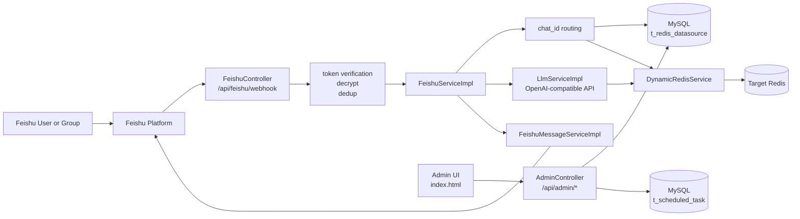
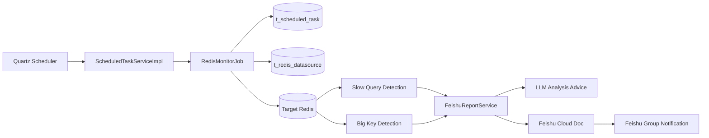

# RDB-Agent

## 项目概述

RDB-Agent 是一个面向飞书场景的 Redis 智能代理系统。它把飞书机器人、动态 Redis 数据源、LLM 能力、定时巡检任务和管理后台组合在一起，让运维或研发人员可以直接在飞书里查询 Redis、执行常见操作、接收巡检报告，并在 Web 后台管理数据源和定时任务。

当前项目不仅支持聊天式 Redis 操作，还支持多群聊映射、多 Redis 实例切换、慢查询与大 Key 巡检、飞书云文档报告生成、群通知发送，以及部署脚本化发布。

## 架构图

### 总体架构



### 定时巡检与报告链路



## 核心能力

### 1. 飞书机器人消息接入

- 接收飞书事件订阅回调，入口为 `POST /api/feishu/webhook`
- 同时支持明文事件和 `encrypt` 加密事件自动解密
- 对 `url_verification` 和普通事件统一校验 `verification-token`
- 对消息事件进行去重，避免飞书重复投递导致重复执行
- 支持群聊和私聊两种回复模式

对应代码：
- `src/main/java/com/example/demo/controller/FeishuController.java`
- `src/main/java/com/example/demo/service/FeishuEventDedupService.java`
- `src/main/java/com/example/demo/utils/FeishuCryptoUtil.java`
- `src/main/java/com/example/demo/dto/feishu/`

### 2. 飞书对话驱动 Redis 操作

机器人收到消息后，会执行以下链路：

1. 解析飞书消息体中的文本内容
2. 去除群聊中的 @机器人 前缀
3. 根据 `chat_id` 找到当前群聊绑定的 Redis 数据源
4. 把自然语言问题发送给 LLM
5. 如果 LLM 返回 Redis 操作 JSON，则执行对应 Redis 命令
6. 如果 LLM 返回普通文本，则直接作为问答结果回复
7. 将结果回发到飞书群聊或私聊

对应代码：
- `src/main/java/com/example/demo/service/impl/FeishuServiceImpl.java`
- `src/main/java/com/example/demo/service/impl/LlmServiceImpl.java`
- `src/main/java/com/example/demo/service/DynamicRedisService.java`

### 3. 多 Redis 数据源与群聊映射

项目不是只连一个 Redis，而是通过数据库维护多套 Redis 配置，并把飞书群聊和 Redis 数据源做映射：

- 每个数据源有独立的 `group_id`
- 每个飞书群聊可绑定一个 `chat_id`
- 收到群消息后，根据 `chat_id` 自动找到对应 Redis
- `DynamicRedisSourceManager` 会为每个数据源动态创建 `StringRedisTemplate`
- 支持新增、编辑、删除和刷新缓存后的重新加载

对应代码：
- `src/main/java/com/example/demo/config/DynamicRedisSourceManager.java`
- `src/main/java/com/example/demo/service/impl/RedisDatasourceServiceImpl.java`
- `src/main/java/com/example/demo/entity/RedisDatasource.java`
- `src/main/resources/db/schema.sql`

### 4. 支持的 Redis 操作类型

当前 LLM 指令解析和执行层支持的能力主要包括：

- String: `get` `set` `delete` `exists` `ttl`
- Hash: `hget` `hgetall` `hset` `hdelete`
- List: `lrange` `lpush` `rpush` `llen`
- Set: `smembers` `sadd` `srem`

说明：
- List 写入时统一使用 `values` 数组格式
- `set` 支持带过期时间的写入
- Redis 操作执行结果会再格式化成自然语言回复

对应代码：
- `src/main/java/com/example/demo/service/impl/LlmServiceImpl.java`
- `src/main/java/com/example/demo/service/RedisService.java`
- `src/main/java/com/example/demo/service/DynamicRedisService.java`

### 5. 管理后台

项目自带一个静态管理后台，默认首页为 `/`，用于管理 Redis 数据源、查询飞书群聊以及维护定时任务。

功能包括：
- Redis 数据源列表查询
- 新增 / 编辑 / 删除数据源
- 测试 Redis 连接
- 飞书群聊关键字查询
- 一键复制 `chat_id`
- 将 `chat_id` 快捷带入数据源或定时任务表单
- 定时任务列表查询
- 新增 / 编辑 / 删除巡检任务
- 启用 / 禁用任务
- 手动立即执行任务

页面与接口：
- 页面：`src/main/resources/static/index.html`
- 前端脚本：`src/main/resources/static/js/app-simple.js`
- 后端接口：`src/main/java/com/example/demo/controller/AdminController.java`

主页面当前包含三个标签页：
- 数据源管理
- 飞书群聊
- 定时任务管理

### 6. 飞书 Chat ID 查询工具

项目还提供一个独立工具页，用于查询当前机器人可见的飞书群聊列表，并复制对应 `chat_id`，方便后台录入数据源时绑定飞书群。

功能包括：
- 按群聊关键字筛选机器人可见群聊
- 调用后端接口查询群聊列表
- 页面展示群名称与 `chat_id` 并支持一键复制
- 明确提示机器人必须已加入目标群

页面与接口：
- 页面：`/feishu-chat.html`
- 页面文件：`src/main/resources/static/feishu-chat.html`
- 前端脚本：`src/main/resources/static/js/chat-id-tool.js`
- 后端接口：`GET /api/feishu/chats`

### 7. Redis 巡检与飞书报告

项目包含基于 Quartz 的定时巡检能力，当前实现了两类检测：

- 慢查询巡检
- 大 Key 巡检

巡检流程如下：

1. Quartz 根据 Cron 触发任务
2. 按任务绑定的 `group_id` 找到 Redis 数据源
3. 使用 Jedis 直连 Redis 执行检测
4. 汇总慢查询和大 Key 结果
5. 调用 LLM 生成优化建议
6. 创建飞书云文档并写入报告内容
7. 把文档链接推送到飞书群聊

对应代码：
- `src/main/java/com/example/demo/service/impl/ScheduledTaskServiceImpl.java`
- `src/main/java/com/example/demo/job/RedisMonitorJob.java`
- `src/main/java/com/example/demo/job/FeishuReportService.java`
- `src/main/java/com/example/demo/entity/ScheduledTask.java`

### 8. LLM 能力使用方式

项目当前把 LLM 用在三个地方：

- 把自然语言解析成结构化 Redis 操作 JSON
- 对非 Redis 问题做直接自然语言回答
- 对巡检报告生成优化建议

当前接入方式为 OpenAI 兼容接口，请求中会发送：
- `model`
- `messages`
- `temperature`
- `Authorization: Bearer <api-key>`

对应代码：
- `src/main/java/com/example/demo/service/LlmService.java`
- `src/main/java/com/example/demo/service/impl/LlmServiceImpl.java`

## 系统架构

### 后端模块

```text
src/main/java/com/example/demo
├── config/        动态 Redis 数据源管理
├── constant/      业务常量
├── controller/    飞书回调接口、管理后台接口
├── dto/           飞书事件 DTO
├── entity/        Redis 数据源、定时任务实体
├── exception/     异常定义
├── job/           Redis 巡检与飞书报告任务
├── mapper/        MyBatis-Plus Mapper
├── service/       服务接口与基础服务
├── service/impl/  核心业务实现
└── utils/         飞书加解密等工具
```

### 前端模块

```text
src/main/resources/static
├── index.html         管理后台首页
├── feishu-chat.html   Chat ID 查询工具页
├── css/               样式文件
└── js/                页面交互脚本
```

### 数据存储

项目当前使用两类存储：

- MySQL：保存 Redis 数据源配置、定时任务配置
- Redis：作为被操作和被巡检的目标实例

数据库结构定义见：
- `src/main/resources/db/schema.sql`

核心业务表：
- `t_redis_datasource`
- `t_scheduled_task`

说明：
- `schema.sql` 中也包含 Quartz 表结构
- 但当前 `application.yml` 配置的是 `spring.quartz.job-store-type: memory`
- 也就是说当前运行时使用的是内存型 Quartz JobStore，不是持久化 Quartz 表

## 主要接口

### 飞书相关接口

- `POST /api/feishu/webhook`
  - 飞书事件订阅回调入口
  - 支持 `url_verification`
  - 支持明文和加密事件
  - 对所有请求进行 token 校验

- `GET /api/feishu/chats`
  - 查询当前机器人可见的飞书群聊列表
  - 支持可选参数 `keyword` 按群名或 `chat_id` 过滤

- `POST /api/feishu/get-chat-id`
  - 保留兼容接口
  - 仅返回错误提示，说明飞书官方不支持通过 `link_token` 反查 `chat_id`

### 管理后台接口

- `GET /api/admin/datasources`：查询数据源列表
- `POST /api/admin/datasources`：新增数据源
- `PUT /api/admin/datasources/{id}`：更新数据源
- `DELETE /api/admin/datasources/{id}`：删除数据源
- `POST /api/admin/datasources/{groupId}/test`：测试连接
- `GET /api/admin/tasks`：查询任务列表
- `POST /api/admin/tasks`：新增任务
- `PUT /api/admin/tasks/{id}`：更新任务
- `DELETE /api/admin/tasks/{id}`：删除任务
- `POST /api/admin/tasks/{id}/toggle?enabled=0|1`：启用或禁用任务
- `POST /api/admin/tasks/{id}/run`：立即执行一次任务

## 运行流程

### 飞书对话链路

```text
飞书消息
  -> FeishuController 接收回调
  -> 校验 token / 解密消息 / 去重
  -> FeishuServiceImpl 解析文本
  -> 根据 chat_id 获取 Redis 数据源
  -> LlmServiceImpl 判断是 Redis 操作还是普通问答
  -> DynamicRedisService 执行 Redis 命令
  -> FeishuMessageServiceImpl 回发飞书消息
```

### 定时巡检链路

```text
Quartz 触发任务
  -> ScheduledTaskServiceImpl 调度 RedisMonitorJob
  -> RedisMonitorJob 连接目标 Redis
  -> 检测慢查询 / 大 Key
  -> FeishuReportService 生成报告
  -> LLM 输出优化建议
  -> 创建飞书云文档并推送群通知
```

## 配置说明

主配置文件：`src/main/resources/application.yml`

### 服务端口

```yaml
server:
  port: 8999
```

### MySQL 配置

用于存放数据源和定时任务配置。

```yaml
spring:
  datasource:
    driver-class-name: com.mysql.cj.jdbc.Driver
    url: jdbc:mysql://localhost:3306/rdb_agent?useUnicode=true&characterEncoding=utf8&serverTimezone=Asia/Shanghai&useSSL=false
    username: dev
    password: 1q2w3e4r
```

### 默认 Redis 配置

该配置提供默认 Redis 连接；群聊动态 Redis 数据源则来自数据库配置。

```yaml
spring:
  redis:
    host: localhost
    port: 6379
    password: test
    database: 0
    timeout: 3000
```

### Quartz 配置

```yaml
spring:
  quartz:
    job-store-type: memory
```

### 飞书配置

```yaml
feishu:
  app-id: your_app_id
  app-secret: your_app_secret
  verification-token: your_verification_token
  encrypt-key: your_encrypt_key
  doc-domain: your_tenant.feishu.cn
```

说明：
- `verification-token` 用于校验飞书请求合法性
- `encrypt-key` 用于解密飞书 `encrypt` 模式事件
- 未配置 `encrypt-key` 时，无法处理加密事件
- `doc-domain` 用于拼接飞书云文档最终访问地址，格式应为实际租户域名，如 `lcnkm9rdfyd7.feishu.cn`
- Redis 巡检报告推送中的文档链接会使用 `https://{doc-domain}/docx/{document_id}` 生成

部署说明：
- 服务器环境中的 `feishu.doc-domain` 必须与飞书浏览器文档真实域名保持一致
- 如果配置错误，报告任务虽然能创建文档，但群里收到的链接会跳到无效页面或错误租户

配置示例：

```yaml
feishu:
  app-id: cli_xxx
  app-secret: xxx
  verification-token: xxx
  encrypt-key: xxx
  doc-domain: lcnkm9rdfyd7.feishu.cn
```

验证方式：
- 手动触发一次巡检任务后，群消息中的文档链接应类似 `https://lcnkm9rdfyd7.feishu.cn/docx/xxxxxxxx`
- 如果链接打开后跳到了别的租户、无效页或错误登录页，优先检查 `feishu.doc-domain` 是否填写为实际浏览器文档域名

### LLM 配置

```yaml
llm:
  api-key: your_llm_api_key
  base-url: https://api.openai.com/v1/chat/completions
  model: gpt-3.5-turbo
```

## 部署方式

### 部署检查清单

- 确认 `application.yml` 中的 `feishu.doc-domain` 已配置为真实飞书文档浏览器域名
- 确认飞书应用已开通文档相关权限：`docx:document`、`docx:document:create`、`docx:document:write_only`
- 确认飞书机器人已在目标通知群内，且 `notify_chat_id` 配置正确
- 确认 Redis 数据源映射和定时任务使用的 `group_id` 一致
- 手动触发一次任务后，检查服务日志中是否出现 `报告推送完成，文档链接:`
- 校验推送出的链接格式是否为 `https://{feishu.doc-domain}/docx/{document_id}`
- 若链接可打开但要求登录，说明链接本身有效，需继续检查飞书侧外部访问策略

### 本地构建

```bash
mvn clean package -DskipTests
```

构建完成后会生成：
- `target/rdb-agent-0.0.1-SNAPSHOT.jar`
- `target/rdb-agent-0.0.1-SNAPSHOT-distribution.tar.gz`
- `target/rdb-agent-0.0.1-SNAPSHOT-distribution.zip`

### 发布包结构

发布包通过 Maven Assembly 生成，定义文件为：
- `src/main/assembly/assembly.xml`

解压后的目录结构如下：

```text
rdb-agent-0.0.1-SNAPSHOT/
├── bin/
│   ├── start.sh
│   └── stop.sh
├── config/
│   ├── application.yml
│   └── mapper/*.xml
├── lib/
│   ├── rdb-agent-0.0.1-SNAPSHOT.jar
│   └── runtime dependencies
└── logs/
```

### 启停脚本

脚本位置：
- `src/main/scripts/start.sh`
- `src/main/scripts/stop.sh`

特点：
- `start.sh` 启动前会自动执行 `stop.sh`
- `start.sh` 会自动清理同级目录下的临时解压目录 `rdb-agent-0.0.1-SNAPSHOT` 和上传包 `rdb-agent-0.0.1-SNAPSHOT-distribution.tar.gz`
- `/root` 下只允许保留一个有效运行目录 `rdb-agent`，备份目录可单独保留
- 默认 JVM 参数为 `-Xms256m -Xmx512m -XX:+UseG1GC`
- 进程 PID 会写入隐藏文件，便于停服和重启
- 日志输出到 `logs/rdb-agent.out`

启动示例：

```bash
./bin/start.sh
```

停止示例：

```bash
./bin/stop.sh
```

## 使用指南

### 1. 配置飞书机器人

需要在飞书开放平台完成：
- 创建企业应用
- 配置事件订阅回调地址：`http://<host>:8999/api/feishu/webhook`
- 订阅 `im.message.receive_v1`
- 配置 `verification-token`
- 如使用加密模式，还需配置 `encrypt-key`
- 开通消息发送相关权限

### 2. 配置 Redis 数据源

打开管理后台 `/` 后：

1. 新增 Redis 数据源
2. 录入飞书群聊 `chat_id`
3. 录入 Redis 地址、端口、密码、数据库编号
4. 点击测试连接
5. 保存配置

完成后，该群聊中的机器人消息就会自动路由到对应 Redis。

### 3. 配置巡检任务

在管理后台的定时任务页中：

1. 选择数据源
2. 配置任务类型：慢查询 / 大 Key / 全部
3. 配置 Cron 表达式
4. 配置阈值
5. 配置飞书通知群 ID
6. 保存并启用任务

### 4. 查询 Chat ID

如果还不知道飞书群聊的 `chat_id`，推荐直接在主页面 `/` 的“飞书群聊”标签页中查询。

你也可以访问独立工具页：
- `/feishu-chat.html`

输入群聊名称关键字后，系统会查询当前机器人可见的群聊列表，并展示可复制的 `chat_id`。

注意：
- 机器人必须已经在目标群中
- 飞书官方不支持通过 `link_token` 直接反查 `chat_id`

## 示例场景

### 飞书提问示例

- `@机器人 查询 key user:1 的值`
- `@机器人 查看 hash user:info 的 name 字段`
- `@机器人 设置 key name 为张三，过期时间 60 秒`
- `@机器人 查询列表 order:list 前 10 个元素`
- `@机器人 删除 key temp:data`
- `@机器人 查看集合 tags 的所有成员`

### 巡检报告示例

定时任务执行后，系统会：
- 统计慢查询列表
- 检测大 Key
- 生成 LLM 分析建议
- 写入飞书云文档
- 把文档链接发送到指定飞书群

## 当前实现边界

以下内容是当前代码状态下需要明确说明的点：

- Quartz 表结构已提供，但默认配置仍是内存模式，不是数据库持久化调度
- 动态 Redis 路由主要依赖 `chat_id -> RedisDatasource` 映射
- 飞书 Chat ID 工具当前基于“机器人可见群聊列表”实现，不支持 `link_token -> chat_id` 反查
- LLM Redis 指令集覆盖常用操作，但不是完整 Redis 命令全集
- 管理后台当前是原生静态页面，不是完整前后端分离 SPA
- 巡检中大 Key 检测当前使用 `keys("*")` 遍历全量 key，适合中小规模实例，不适合超大生产实例直接无约束使用

## 关键文件索引

- 启动入口：`src/main/java/com/example/demo/DemoApplication.java`
- 飞书回调：`src/main/java/com/example/demo/controller/FeishuController.java`
- 管理接口：`src/main/java/com/example/demo/controller/AdminController.java`
- 飞书消息处理：`src/main/java/com/example/demo/service/impl/FeishuServiceImpl.java`
- 飞书消息发送：`src/main/java/com/example/demo/service/impl/FeishuMessageServiceImpl.java`
- LLM 处理：`src/main/java/com/example/demo/service/impl/LlmServiceImpl.java`
- 动态 Redis 管理：`src/main/java/com/example/demo/config/DynamicRedisSourceManager.java`
- 数据源服务：`src/main/java/com/example/demo/service/impl/RedisDatasourceServiceImpl.java`
- 定时任务服务：`src/main/java/com/example/demo/service/impl/ScheduledTaskServiceImpl.java`
- Redis 巡检任务：`src/main/java/com/example/demo/job/RedisMonitorJob.java`
- 飞书报告生成：`src/main/java/com/example/demo/job/FeishuReportService.java`
- 数据库结构：`src/main/resources/db/schema.sql`
- 管理后台：`src/main/resources/static/index.html`
- Chat ID 工具：`src/main/resources/static/feishu-chat.html`
- 部署脚本：`src/main/scripts/start.sh` `src/main/scripts/stop.sh`
- 发布打包：`src/main/assembly/assembly.xml`

## 开发与测试

运行测试：

```bash
mvn test
```

本地启动：

```bash
mvn spring-boot:run
```

如需远程调试，可自行在启动前注入 `JAVA_OPTS`，例如：

```bash
export JAVA_OPTS="-Xms256m -Xmx512m -XX:+UseG1GC -agentlib:jdwp=transport=dt_socket,server=y,suspend=n,address=9999"
./bin/start.sh
```
